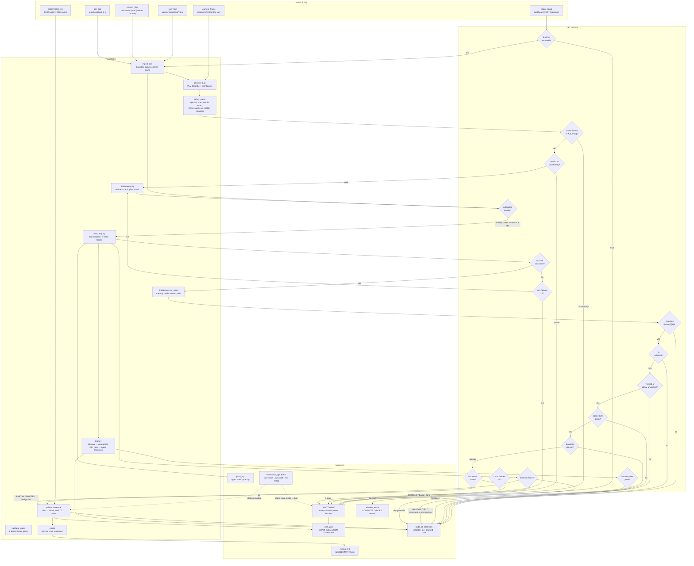

# Agent Data Flow — Decision Tree

One diagram, one reference table. The rule the tree encodes: **the model proposes, the validator disposes** — every path that can move the robot passes through the validator gates, and every path ends in HALT.

## Node Reference

### Input nodes

| Node | Type | Description | Dependencies | Functions |
|---|---|---|---|---|
| `user_text` | Input | Operator/voice instructions, bounded queue so floods can't wedge the loop | voice assistant, WebUI, `/api` | `Ingest.user_queue` |
| `mission_files` | Input | Scripted mission steps; re-read only when mtime changes | filesystem (`missions/`) | `Ingest.missions` |
| `camera_frame` | Input | Vision frames; lazy capture, absent in `--simulate`/`--no-vision` | picamera2 / OpenCV, camera hardware | `Ingest` camera path |
| `idle_tick` | Input | 1 s heartbeat that drives cycles when nothing else is queued | `AgentLoop.run` | loop timer |
| `estop_signal` | Input | Operator stop request; highest precedence, bypasses every gate | dashboard (`POST /api/estop`), SIGINT | `Validator.halt` |
| `esp32_telemetry` | Input | Battery (`T:207`) and joints (`T:106`) polled through the validator's serial owner | pyserial, ESP32 UART | `Validator.read_battery`, `read_joints` |
| `vlm_server` | Input (external) | llama-server hosting Qwen3-VL GGUF at `127.0.0.1:8080`; absent → perception/de-liberation degrade to SKIP | llama.cpp, model GGUF | `VLModel` HTTP client |

### Process nodes

| Node | Type | Description | Dependencies | Functions |
|---|---|---|---|---|
| `ingest (L0)` | Process | Collects and bounds all inputs; never decides | none above stdlib | `agent/ingest.py` |
| `perceive (L1)` | Process | One VLM call per cycle: frame → description → intent | `vlm_server`, `camera_frame` | `Perceive.process`, `VLModel.describe`, `parse_intent` |
| `safety_gates` | Process | Software-first checks on model output and vision stream | `safety.py`, camera ring | `scan_injection`, `check_verdict`, `check_frame_sanity`, `pre_motion_checklist` |
| `deliberate (L2)` | Process | Arbitrates input priority, emits exactly one tool call | `perceive`, `TOOL_SCHEMAS` | `Deliberate.decide`, `._arbitrate` |
| `execute (L3)` | Process | Runs the tool; owns the failure ladder (retry → halt) | `ToolRunner`, `validator` | `Execute.dispatch`, strike counter |
| `ToolRunner.set_state` | Process | **The only model motion path.** Forwards hex to validator with `source="model"` | `tools.py`, `validator` | `ToolRunner.run`, regex fallback |
| `validator_gates` | Process | Deterministic safety checks; no AI, no exceptions to the rules | `state_table.yaml` codebook | `Validator.validate` |
| `validator.execute` | Process | Translates approved hex → ESP32 JSON, writes UART, audits every decision | pyserial, `state.db` | `Validator.execute`, `._audit`, `._get_serial` |
| `learner` | Process | Quarantines observations; promotes only gated knowledge; never grants motion authority | `state.db`, `scan_injection` | `Learner.observe`, `eligible`, `promote`, `idle_pass` |
| `runlog` | Process | Human-readable decision tree of the run (✓/✗/⊘ per node) | filesystem (`logs/`) | `RunLog.start_run`, `.node`, `.frame` |

### Decision nodes

| Node | Question | YES / PASS path | NO / FAIL path |
|---|---|---|---|
| `d_estop` | ESTOP received? | `halt` (bypass everything) | normal cycle |
| `d_sanity` | Frame frozen or loop? | → `halt` (vision untrustworthy) | continue perception |
| `d_verdict` | Verdict in vocabulary? | → deliberate | → `halt` (BLOCKED) |
| `d_arbitrate` | Which input wins? | fixed order: **Safety > user > mission > idle** | — |
| `d_toolparse` | Tool call parseable? | → `set_state` | strike++ → retry, ≥3 → `halt` |
| `d_hex` | `^[0-9A-F]{6}$`? | next gate | reject, `consecutive_bad++`, audit |
| `d_codebook` | Code in codebook? | next gate | reject, audit |
| `d_verified` | Verified (or override set)? | next gate | reject, audit |
| `d_speed` | Speed byte ≤ max? | next gate | reject, audit |
| `d_transition` | Transition allowed? | next gate | reject, audit |
| `d_streak` | Bad streak > max? | → **FORCED_HALT** | proceed to execute |
| `d_loopfail` | ≥5 consecutive cycle failures? | clean exit (halt first) | continue |
| `d_mission` | Mission verdict? | CLEAR → done; PARTIAL/DRIFTED → one bounded correction; BLOCKED/exhausted → `abort` | — |
| `d_promote` | Learner gates pass? | promote to `core` (trusted tier) | stay quarantined |

### Output nodes

| Node | Type | Description | Dependencies | Functions |
|---|---|---|---|---|
| `uart_json` | Output | ESP32 motion commands, one JSON per line, 115200 8N1 | serial owner (validator) | UART write |
| `halt (000000)` | Output | Terminal safe state; always allowed, never gated; 12 production callers | `Validator.halt` | `execute(HALT)` |
| `audit_db` | Output | `state.db`: `validator_log` (every decision), `learned` (quarantine), `core` (trusted) | sqlite3, thread-safe | `Validator._audit`, `Learner` |
| `jsonl_log` | Output | Machine-readable cycle log for post-run analysis | filesystem | `Outputs.log` |
| `runlog_md` | Output | Per-day markdown decision tree; run 1 verbose, later runs compact | filesystem | `RunLog._write` |
| `dashboard_api` | Output | Read-only window + one write (estop); token auth, rate-limited, estop exempt | FastAPI, shared validator | `create_app`, `/api/status`, `/api/audit`, `/ws` |
| `mission_result` | Output | `COMPLETE` or `ABORT: <reason>` — never a silent partial | `VisualPipeline` | `.run`, `.abort` |

## Invariants the tree must preserve

1. **Single motion path for the model**: model text reaches `uart_json` only via `set_state → validator_gates → validator_execute`. The mission path bypasses the tool layer but only with human-authored constants (`source="mission"`).
2. **Every path ends in halt**: any exception, gate failure, strike limit, or shutdown converges on `halt` — level-based `T:111` can never outlive its controller.
3. **Learning never grants motion authority**: `d_promote` refuses hex-shaped keys; the codebook is human-owned YAML.
4. **Single serial owner**: loop + dashboard share one `Validator` instance in one process (`serve.py`); the failsafe daemon only writes after the owner dies.
